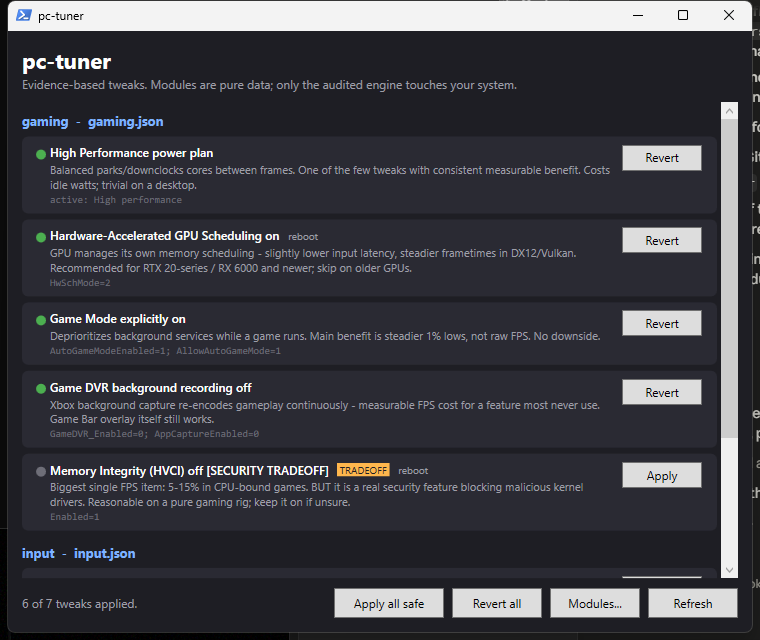

# pc-tuner

**Evidence-based Windows gaming & network tweaks — data-only modules, an auditable engine, and full backup/revert.**

[](LICENSE)
[](https://learn.microsoft.com/powershell/)
[](https://github.com/skyphose/pc-tuner/actions/workflows/ci.yml)



---

## ⚠️ WARNING — read before running

**This tool modifies Windows: registry values, the active power plan, and network
adapter settings.** It is designed to be safe and reversible, but you should
understand what that means:

- **Every change is backed up first.** Before any value is touched, its original
  state is saved to `pc-tuner-backup.json`. `.\pc-tuner.ps1 -Revert all`
  restores your exact original state (see [Restoring](#restoring)).
- **Preview before you apply.** Run any apply with `-DryRun` to print the exact
  changes without making them. The GUI shows the same change list in a
  confirmation dialog.
- **One tweak is a real security tradeoff.** `memory-integrity` disables
  Hypervisor-Enforced Code Integrity (HVCI), a genuine Windows security feature,
  for a measurable FPS gain. It is **never** applied by the `safe` tier, requires
  an explicit `-AcceptTradeoffs` flag on the CLI, and shows a warning dialog in
  the GUI. pc-tuner will never ship tweaks that disable Defender, UAC, or the
  firewall (see [Deliberately excluded](#deliberately-excluded-researched-found-harmful-or-snake-oil)).
- **No system-wide side effects.** The engine can only set individual registry
  values, activate a power plan, and change NIC advanced properties. It cannot
  install anything, download anything, disable services, or run arbitrary
  commands (see [Trust model](#trust-model--why-you-can-verify-this-isnt-malware)).
- Some tweaks need a **reboot** to take effect; the tool tells you when.
- For extra peace of mind, create a Windows restore point first
  (`Checkpoint-Computer`, or System Protection in Settings). pc-tuner's own
  per-value backup is more precise, but defense in depth is cheap.

## Features

- 🎮 **Evidence-based tweaks only** — every tweak documents *why* it works and
  cites the reasoning; known snake oil is explicitly excluded.
- 🔍 **Fully auditable** — one ~300-line engine script is the only executable
  code that can modify your system; tweak modules are pure JSON data.
- 💾 **Automatic backup & one-command revert** of every original value.
- 🖥️ **GUI and CLI** — a WPF front end for point-and-click, a scriptable CLI
  with dry-run and machine-readable status.
- 🛡️ **Risk tiers** — `safe` tweaks are one command; `tradeoff` tweaks require
  explicit opt-in.
- 🧩 **Extensible** — drop a validated JSON file in `modules/` to add a tweak pack.

## Trust model — why you can verify this isn't malware

The design rule: **tweaks are data, not code.**

- All executable logic lives in one file: [`pc-tuner.ps1`](pc-tuner.ps1) (~300
  lines of plain PowerShell — read it once, you've audited everything that can
  run).
- Tweaks live in [`modules/*.json`](modules/) — **pure JSON, no code**. A module
  can only *describe* changes using the engine's fixed action vocabulary:

  | action | what it can do |
  |---|---|
  | `registry` | set one registry value |
  | `registry-flags` | merge flags into a `key=value;` registry string, preserving other flags |
  | `powercfg-scheme` | activate a power plan |
  | `netadapter-advanced` | set network adapter advanced properties |

  A module physically cannot download files, run commands, or touch anything
  outside those actions. The engine refuses unknown action types.
- Before any change, the original value is saved to `pc-tuner-backup.json`.
  `.\pc-tuner.ps1 -Revert all` restores your exact original state.
- When applying, the engine prints every individual change it makes.
- The GUI ([`pc-tuner-gui.ps1`](pc-tuner-gui.ps1)) is also a single plain-text
  PowerShell/WPF script — no compiled binaries anywhere in this project. It
  never modifies the system itself; every Apply/Revert shells out to the
  engine, so the engine remains the single audited modification path.

## Requirements

- **Windows 10 or 11** (64-bit)
- **PowerShell 5.1+** (the version built into Windows — no install needed)
- **Administrator rights** for tweaks that touch `HKLM` or network adapters
  (the tool re-launches itself elevated via UAC when needed; status and HKCU
  tweaks work without elevation)

## Install

```powershell
git clone https://github.com/skyphose/pc-tuner.git
cd pc-tuner
```

Or download and extract the
[latest release ZIP](https://github.com/skyphose/pc-tuner/archive/refs/heads/main.zip).
There is nothing to install — the scripts run in place.

## Usage

### GUI (recommended)

```powershell
powershell -ExecutionPolicy Bypass -File .\pc-tuner-gui.ps1
```

Shows every tweak with its evidence, current state, and the exact change list
in a confirmation dialog before anything is applied.

### CLI

```powershell
.\pc-tuner.ps1                      # status of every tweak (read-only, safe to run)
.\pc-tuner.ps1 -StatusJson          # machine-readable status (used by the GUI)
.\pc-tuner.ps1 -Apply safe -DryRun  # print exactly what would change, change nothing
.\pc-tuner.ps1 -Apply safe          # apply all safe-tier tweaks
.\pc-tuner.ps1 -Apply hags          # apply specific tweak(s)
.\pc-tuner.ps1 -Apply memory-integrity -AcceptTradeoffs   # gated tradeoff tweak
.\pc-tuner.ps1 -Revert all          # undo everything from backup
```

Every run is also transcribed to `pc-tuner-last-run.log`.

## Included modules

| Module | Tweak | Risk | Admin | Reboot | What it does |
|---|---|---|---|---|---|
| gaming | `power-plan` | safe | – | – | Activates the High Performance power plan |
| gaming | `hags` | safe | ✓ | ✓ | Hardware-Accelerated GPU Scheduling on |
| gaming | `game-mode` | safe | – | – | Game Mode explicitly on |
| gaming | `game-dvr` | safe | – | – | Game DVR background recording off (Game Bar still works) |
| gaming | `windowed-optimizations` | safe | – | – | Flip-model presentation for borderless/windowed DX10/11 games |
| gaming | `memory-integrity` | **tradeoff** | ✓ | ✓ | HVCI off — 5–15% in CPU-bound games, real security tradeoff |
| input | `mouse-accel` | safe | – | – | "Enhance Pointer Precision" (mouse acceleration) off |
| network | `ethernet-powersave` | safe | ✓ | – | Green Ethernet / Power Saving Mode / Gigabit Lite off on Realtek NICs |

Each tweak's `why` field (shown in the GUI and `-StatusJson`) documents the
evidence behind it.

## Restoring

```powershell
.\pc-tuner.ps1 -Revert all        # restore every tweak from backup
.\pc-tuner.ps1 -Revert hags       # restore a specific tweak
```

Revert restores the exact value captured before the change. If no backup
exists for a tweak, it falls back to the documented `default` in the module
(or removes a value that didn't exist before). Adapter settings are the one
exception: with no backup they are left as-is with a warning, since there is
no safe universal default.

## Writing a module

Drop a `.json` file in `modules/`:

```json
{
  "module": "my-pack",
  "description": "what this pack is for",
  "tweaks": [
    {
      "id": "unique-id",
      "name": "Human name",
      "risk": "safe",
      "needsAdmin": false,
      "needsReboot": false,
      "why": "Evidence for why this helps. Cite benchmarks.",
      "actions": [
        { "type": "registry", "path": "HKCU:\\...", "name": "Value",
          "value": 1, "valueType": "DWord", "default": 0 }
      ]
    }
  ]
}
```

`default` is what revert falls back to if no backup exists.

Modules are validated at load: unknown action types, missing required fields,
bad `risk` values, non-HKLM/HKCU registry paths, and duplicate ids are all
rejected with specific errors — the module is skipped, never partially run.
Test yours with `.\pc-tuner.ps1 -Apply <id> -DryRun`.

## Deliberately excluded (researched, found harmful or snake oil)

- `NetworkThrottlingIndex` / `SystemResponsiveness` hacks — increase DPC
  latency and cause audio crackle, especially on Ryzen
- `TcpAckFrequency` / Nagle tweaks — no measurable modern benefit
- Disabling the page file — causes crashes when RAM fills
- Timer-resolution forcing tools — thrash a core; mostly placebo since the
  Windows 2004 rule change
- Debloat scripts / stripping services — break WebView2 apps (Discord,
  Steam), search, sometimes Explorer itself
- Disabling Windows Defender — no

PRs adding these will be declined with citations.

## Contributing

Contributions are welcome — especially new tweak modules with real evidence.

1. Fork the repo and create a branch.
2. Add or edit a module in `modules/` (pure JSON — see
   [Writing a module](#writing-a-module)). Engine changes should be rare and
   must preserve the "modules are data" trust model.
3. Verify with `.\pc-tuner.ps1 -Apply <id> -DryRun` and make sure CI
   (PSScriptAnalyzer + module validation) passes.
4. Open a PR describing the tweak and linking to benchmarks or vendor
   documentation.

## License

[MIT](LICENSE)
